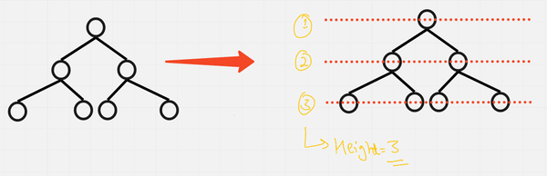
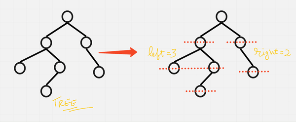

### 1. [Maximum Depth of a Binary Tree](https://leetcode.com/problems/maximum-depth-of-binary-tree/description/)

* Given the root of a binary tree, return its maximum depth.
* A binary tree's **maximum depth** is the number of nodes along the longest path from the root node down to the farthest leaf node.
* It can also be called as a Height of a binary tree.





* We traverse all paths and take max of all.
* If we are at a node it itself is of height 1 + then the subtrees which gives max , either left or right subtree.
```java
// Time - O(n) => we are visiting all nodes
// space - O(n) => Auxiliary stack space in case of a skewed binary tree
 public int maxDepth(TreeNode root) {
        if(root == null) return 0;

        int left = maxDepth(root.left);
        int right = maxDepth(root.right);

        return 1 + Math.max(left,right);
    }
```
* We can use Level order traversal to get the max height => the number of levels will be the max height.
<br>

### 2. [Balanced Binary Tree](https://leetcode.com/problems/balanced-binary-tree/description/)
* Given a binary tree, determine if it is height-balanced.
* A **height-balanced** binary tree is a binary tree in which the depth of the two subtrees of every node never differs by more than one.
* A Binary tree is said to be height balanced binary tree if all it`s nodes have a balance factor of 1 , 0 or -1 .
* That is for All nodes **Balance Factor**  |_bf_| = |_Hl_ - _Hr_| <= 1 .
* Where **Hl** is height of left subtree , **Hr** is the height of right subtree.
* _Approach 1_ 
    * At each node calculate Left height and right Height then check the condition.
    * Do this for all nodes , if any node does not satisfy the condition the return false.
```java
    // Time => O(n^2) => find height takes O(n)
    public boolean isBalanced(TreeNode root) {
        if(root == null) return true;
        int left = findHeight(root.left);
        int right = findHeight(root.right);

        return (Math.abs(left-right) <= 1) && (isBalanced(root.left) && isBalanced(root.right));
    }

    public int findHeight(TreeNode root){
        if(root == null) return 0;

        int left =  findHeight(root.left);
        int right = findHeight(root.right);

        return 1 + Math.max(left,right);
    }
```

* _Approach 2_
    * While calculating the height only , check for condition and keep track if there is a node that failed condition.
```java
    // Time => O(n)
    public boolean isBalanced(TreeNode root) {
        return findHeight(root) != -1 ; // == -1 means false  
    }

    public int findHeight(TreeNode root){
        if(root == null) return 0;

        int left =  findHeight(root.left);
        int right = findHeight(root.right);
        // Any condition is satisfied then it is not a balanced binary tree
        if(left == -1 || right == -1 || Math.abs(left-right) > 1) return -1;

        return 1 + Math.max(left,right);
    }
```
<br>

### 3. [Diameter of Binary Tree](https://leetcode.com/problems/diameter-of-binary-tree/description/)
* Given the root of a binary tree, return the length of the diameter of the tree.
* The **diameter** of a binary tree is the length of the longest path between any two nodes in a tree. This path may or may not pass through the root.
* The **length** of a path between two nodes is represented by the number of edges between them.
* For every node, length of longest path which pass it = MaxDepth of its left subtree + MaxDepth of its right subtree.

```java
    // Time = O(n) => where n = number of nodes
    // Space = O(H) => H = height of the tree
    public int diameterOfBinaryTree(TreeNode root) {
        if(root == null) return 0 ;
        int max[] = {0};
        findHeight(root,max);
        

        return max[0] ; // We can also use a global variable instead of a array 
    }
     public int findHeight(TreeNode root,int[] max){
        if(root == null) return 0;

        int left =  findHeight(root.left,max);
        int right =  findHeight(root.right,max);
        // For every node we are updating max , with respect to current diameter
        // Diameter = lh + rh
        max[0] = Math.max(max[0] , left + right);

        return 1 + Math.max(left,right);
    }
```
<br>

### 4. [Same Tree](https://leetcode.com/problems/same-tree/description/)
* Given the roots of two binary trees p and q, write a function to check if they are the same or not.
* Two binary trees are considered the same if they are structurally identical, and the nodes have the same value.
* _Approach :_
    * Check the base case: if both trees are null, return true.
    * Check if only one tree is null or the values of the current nodes are different, return false.
    * Recursively check if the left subtrees of both trees are identical.
    * Recursively check if the right subtrees of both trees are identical.
    * Return the logical AND of the results from steps 3 and 4.

```java
    // Time - O(min(n,m)) => where n,m are the number of nodes in tree 1, 2 respectively
    // space - O(min(H1,H2)) => where H1 and H2 are the heights of the two trees, respectively.  
    public boolean isSameTree(TreeNode p, TreeNode q) {
        // Base case: if both trees are null, they are identical
        if (p == null && q == null) {
            return true;
        }
        // If only one tree is null or the values are different, they are not identical
        if (p == null || q == null || p.val != q.val) {
            return false;
        }
        // Recursively check if the left and right subtrees are identical
        return isSameTree(p.left, q.left) && isSameTree(p.right, q.right);
    }
```
<br>

### 5. [Symmetric Tree](https://leetcode.com/problems/symmetric-tree/description/)
* Given the root of a binary tree, check whether it is a mirror of itself (i.e., symmetric around its center).
* _Approach :_
    * *Symmetric* :
        * Consider tree T 
        * if T is null, then T is symmetric.
        * if T->left is mirror of T->right,then T is symmetric.
    * *isMirror* :
        * if L = R = NULL, then L is mirror of R.
        * if L and R both not NULL,and L->left is mirror of R->right,and L->right is mirror of R->left,then L and R is mirror and L.val == R.Val.
```java
    public boolean isSymmetric(TreeNode root) {   
        return isMirror(root,root);
    }
    public boolean isMirror(TreeNode p, TreeNode q) {
        if (p == null && q == null) {
            return true;
        }
        
        if(p == null || q == null) return false;
        
        return (p.val == q.val) && isMirror(p.left,q.right) && isMirror(p.right,q.left);
    }

```

### 6. [Count Complete Tree Nodes](https://leetcode.com/problems/count-complete-tree-nodes/description/)
* Given the root of a complete binary tree, return the number of the nodes in the tree.
* Every level, except possibly the last, is completely filled in a complete binary tree, and all nodes in the last level are as far left as possible. It can have between `1` and `2^h` nodes inclusive at the last level h.
* Given Constraints that Test cases are guqrateed Complete Binary Tree.
* Return the Total count of Nodes.
* _Approach 1_:
```java
    // Time - O(n) => n = number of nodes
    // space - O(H) => H = height of the tree
    public int countNodes(TreeNode root) {
        if(root==null) return 0;
        int left = countNodes(root.left);
        int right = countNodes(root.right);
        return 1+left+right;
        
    }
```
* _Approach 2_:
    * We will now try to form an algorithm that takes less than O(N) time.
    * We are given a complete binary tree that has two special properties:
    * All levels except the last one are completely filled
    * Last level nodes are as left as possible.
    * If we get to know the height of the binary tree (say h), we can find out the maximum number of nodes that can be present by the formula: `2h – 1`. So there is some relation between height and number of nodes.
    * How to find the height in less than O(N) time? As the given tree is a complete binary tree, we can find the height of the binary tree by just finding the left height of the tree, as the left height will always be equal to the height of the tree.
    * [Refer](https://www.youtube.com/watch?v=u-yWemKGWO0)


      ```java
        // Time - O((logN)^2)
        // Space - O(logN) => log N => Height of the tree
        static int findHeightLeft(Node cur) {
        int hght = 0; 
        while(cur!=null) {
            hght++; 
            cur = cur.left; 
        }
        return hght; 
        }

        static int findHeightRight(Node cur) {
                int hght = 0; 
                while(cur!=null) {
                    hght++; 
                    cur = cur.right; 
                }
                return hght; 
            }

        static int countNodes(Node root) {
                if(root == null) return 0; 
                
                int lh = findHeightLeft(root); 
                int rh = findHeightRight(root); 
                
                if(lh == rh) return (1<<lh) - 1; 
                
                int leftNodes = countNodes(root.left);
                int rightNodes = countNodes(root.right);
                
                return 1 + leftNodes + rightNodes; 
            }
      ```