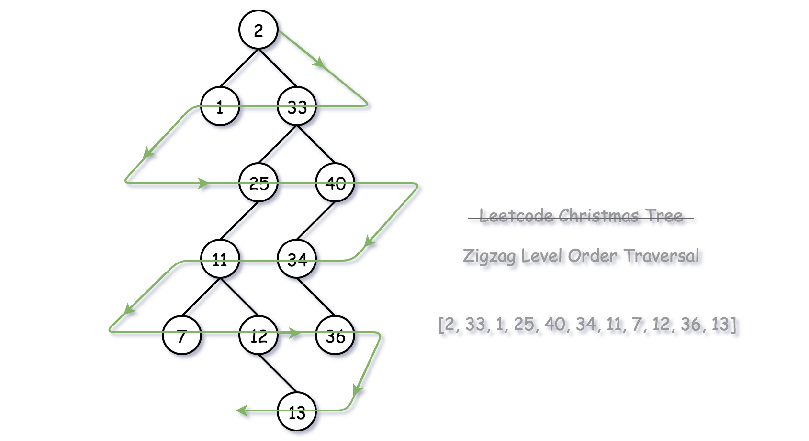

### 1. [Binary Tree Maximum Path Sum](https://leetcode.com/problems/binary-tree-maximum-path-sum/description/)
* A `path` in a binary tree is a sequence of nodes where each pair of adjacent nodes in the sequence has an edge connecting them. A node can only appear in the sequence `at most once`. 
* Note that the path does not need to pass through the root.
* The path sum of a path is the sum of the node's values in the path.
* Given the root of a binary tree, return the maximum path sum of any non-empty path.
* This Problem is exactly same as **[Diameter of Binary Tree](https://leetcode.com/problems/diameter-of-binary-tree/description/)** in this , at each node we find the length of the path from that node and update max.
* Here , instead of path , we have to consider the value of the node.
* The code is exactly similar to _Diameter of binary Tree_ problem with slight modification.
* If want maximum sum , will it be useful to consider a path which gives us negative sum , this we have to keep in mind.
    ```java
    int maxSum = (int)-1e9 ;
    public int maxPathSum(TreeNode root) {
        findHeight(root);
        return maxSum;
    }
    public int findHeight(TreeNode root){
        if(root == null) return 0;

        int left =  findHeight(root.left);
        // It is obvious to avoid the path which gives negative sum
        int leftSum = Math.max(left,0);

        int right = findHeight(root.right);
        int  rightSum = Math.max(right,0);

        maxSum = Math.max(maxSum,root.val + leftSum + rightSum);
        return root.val + Math.max(leftSum,rightSum);
    }
    ```
<br>

### 2. [Binary Tree Zig-Zag Level order Traversal](https://leetcode.com/problems/binary-tree-zigzag-level-order-traversal/description/)
* Given the `root` of a binary tree, return the _zigzag level order traversal of its nodes_ values. (i.e., from left to right, then right to left for the next level and alternate between).
    * 

    
    <br>
    <br>


    * 

* _Approach 1 :_
    * We can perform a Normal level order traversal , and whennever reverse order is required we can reverse the current List and add it to the final , answer.
    * we can use a boolean variable to keep track of when to reverse.
    * But it takes extra time to reverse .
    ```java
            if(flag){
                ans.add(curr); 
                flag = false;
            }
            else{
                Collections.reverse(curr);
                ans.add(curr);
                flag = true;
            }
    ```
<br>

* _Approach 2 :_
    * Instead of adding all values to the list and , reversing it , we can add it at the back while adding values to the list for the first time itself.
    ```java
    // Time - O(N) , where n is the number of nodes
    // Space - O(N/2) , in case of complete binary tree the q will be having n/2 nodes
     public List<List<Integer>> zigzagLevelOrder(TreeNode root) {
        List<List<Integer>> ans = new ArrayList<>();
        if(root == null) return ans;
        boolean flag = true; // true => normal , false => reverse
        Queue<TreeNode> q = new LinkedList<>();
        q.offer(root);
        while(!q.isEmpty()){
            List<Integer> curr = new ArrayList<>();
            int level = q.size();
            for(int i = 0 ; i < level ; i++){
                TreeNode temp = q.peek();
                if(temp.left != null) q.offer(temp.left);
                if(temp.right != null) q.offer(temp.right);
                // curr.add(temp.val);
                if (flag) curr.add(temp.val);
                // we are providing index to the add method , specifying where to add the given value
                else curr.add(0, temp.val); // Add to the beginning of the list
                // for reverse every time a new value comes in we will add it at the first
                // pushing the existing elements to the back
                q.poll();
            }
            ans.add(curr);
            flag = !flag ; // change the order alternately        
        }
        return ans;
    }
    ```
<br>

### 3. [Boundary Traversal of Binary Tree](https://www.codingninjas.com/studio/problems/boundary-traversal-of-binary-tree_790725?utm_source=striver&utm_medium=website&utm_campaign=a_zcoursetuf)
* You are given a binary tree having 'n' nodes.
* The boundary nodes of a binary tree include the nodes from the left and right boundaries and the leaf nodes, each node considered once.
* Figure out the boundary nodes of this binary tree in an `Anti-Clockwise` direction starting from the root node.
* _Example :_
    * 
<br>

* _Approach:_ Boundary traversal in an anti-clockwise direction can be described as a traversal consisting of three parts:
    1. **Part 1**: Left Boundary of the tree (excluding the leaf nodes).
    2. **Part 2**: All the leaf nodes travelled in the left to right direction.
    3. **Part 3**: Right Boundary of the tree (excluding the leaf nodes), traversed in the reverse direction.

    ```java
        // Time - (left + leaf + right) =>  O(H) + O(N) + O(H) ~= O(N) , where H is the height of the tree , N is the number of nodes
        public static List<Integer> traverseBoundary(TreeNode root){
        // Write your code here.
        List<Integer> res = new ArrayList<>();
        if(root == null) return res;
        // Part -1
        List<Integer> left = new ArrayList<>();
        left.add(root.data);

        TreeNode curr = root.left;
        if(curr != null){ // if left of root is null ,then we cannot access it`s left or right
            // while curr is not a leaf node , cover all boundary nodes on the left side
            while( !(curr.left == null && curr.right == null) ){
            left.add(curr.data);
            if(curr.left != null) curr = curr.left;
            else curr = curr.right ;
            }
        }

        // Part -2
        // we can use any of the tree traversals to get the leaf nodes
        // Hence we need left to right we can use in order traversal => Left Root Right
        // If any node has both left = null and right = null then it is a leaf node
        List<Integer> leaf = new ArrayList<>();
        inOrder(root,leaf);

        // Part - 3 
        List<Integer> right = new ArrayList<>();
        curr = root.right;
        if(curr != null){ // if there is no right for root , then we cannot access its right or left
            // till it is not a leaf node 
            while(!(curr.left == null && curr.right == null)){
                // Taking care of Anti clock wise 
                right.add(0,curr.data);
                if(curr.right != null) curr = curr.right;
                else curr = curr.left;
            }
        }

        for(int i : left) res.add(i);
        for(int i : leaf) res.add(i);
        for(int i : right) res.add(i);

        return res;
    }
    private static void inOrder(TreeNode root , List<Integer> in){
        if(root == null) return;

        if(root.left == null && root.right == null) in.add(root.data);
        // Go as left as possible
        inOrder(root.left,in);
        inOrder(root.right,in);
    }
    ```
### 4. [Vertical Order Traversal of a Binary Tree](https://leetcode.com/problems/vertical-order-traversal-of-a-binary-tree/description/)
* Given the `root` of a binary tree, calculate the **vertical order traversal** of the binary tree.
* For each node at position `(row, col)`, its left and right children will be at positions `(row + 1, col - 1)` and `(row + 1, col + 1)` respectively. The root of the tree is at `(0, 0)`.
* The **vertical order traversal** of a binary tree is a list of top-to-bottom orderings for each column index starting from the leftmost column and ending on the rightmost column. There may be multiple nodes in the same row and same column. In such a case, sort these nodes by their values.
* Return the **vertical order traversal** of the binary tree.
* _Example 1 :_
    * 
    * _Output :_ [[4],[2],[1,5,6],[3],[7]]
* _Example 2 :_
    * 
    * There can be duplicate values among the nodes (here 10 is repeated twice).
    * If two or more nodes are overlapping at the same position(here 10 and 9), then they will be printed in ascending order. 
*  [Reference Blog](https://takeuforward.org/data-structure/vertical-order-traversal-of-binary-tree/) <hr> 
*  [Reference Video](https://www.youtube.com/watch?v=q_a6lpbKJdw)
*  In the above references , they used level order traversal
*  [My Code](https://leetcode.com/submissions/detail/1166527084/) , where i used inOrder Traversal. (: we can use any traversal to visit all the nodes of the tree.

<br>

### 5. [Top view of Binary Tree](https://www.geeksforgeeks.org/problems/top-view-of-binary-tree/1)
* You are given a Binary Tree of 'n' nodes.
* The Top view of the binary tree is the set of nodes visible when we see the tree from the top.
* Find the top view of the given binary tree, from left to right.
* _Example :_
    * 
    * _Output :_ [10, 4, 2, 1, 3, 6]
<br>

* _Approach :_
    *  
    * If we observe the image it is somewhat similar to vertical order traversal.
    * _Pre-requisite :_ **Vertical Order Traversal** at every level we have to consider the `1st` node.
    * We can use level order traversal for traversing. , If we want to use a `recursive approach` then we have take care of `height` also. [refer](https://www.youtube.com/watch?v=Et9OCDNvJ78&t=544s) at `8:59` sec.
    ```java
    // Time - O(n)
    // Space - O(n)
    public static List<Integer> getTopView(TreeNode root) {
        List<Integer> res = new ArrayList<>();
        if(root == null) return res;
        
        Queue<Pair> q = new LinkedList<>();
        
        q.offer(new Pair(root,0));
        
        TreeMap<Integer,TreeNode> map = new TreeMap<>(); // to track which node is at which level
        
        while(!q.isEmpty()){
            Pair curr = q.poll();
            int level = curr.level ;
            if(!map.containsKey(level)){
                map.put(level,curr.node);
            }
            // to left level is decreased by 1
            if(curr.node.left != null) q.offer(new Pair(curr.node.left,level-1)); 
            if(curr.node.right != null) q.offer(new Pair(curr.node.right , level+1)); 
            // to right level is increased by one
        }
        
        // map.get(i) => gives us a a node at ith level
        // since we are using a tree map , i is in sorted order ( from left to right )
        for(int i : map.keySet()) res.add(map.get(i).data); 
        
        return res;
        
    }
    class Pair{
        int level; // vertical level
        TreeNode node;
        public Pair(TreeNode root,int level){
            this.node = root;
            this.level  = level;
        }
    }
    ```
### 6. [Bottom view of Binary Tree](https://www.geeksforgeeks.org/problems/bottom-view-of-binary-tree/1)
* Given a binary tree, print the bottom view from left to right.
* A node is included in bottom view if it can be seen when we look at the tree from bottom.
* _Example 1 :_
    * 
    * _Output :_ [40, 20, 60, 30]
* _Approach :_
    * 
    * _Pre-requisite_ **vertical order traversal**.
    * same as Top view , but at each level we took the first node that comes , but here we need to take the node that comes last in a particular level.
    * code is same as above make the below change
    ```java
    /* if(!map.containsKey(level)){
                map.put(level,curr.node);
            }
    */
    // remove above lines and keep on updating the nodes for a level
    // so at the end we will have nodes that occur last at any level.
    map.put(level,curr.node);
    ```

### 7. [Left/Right side view of Binary Tree](https://leetcode.com/problems/binary-tree-right-side-view/description/)
* Given the root of a binary tree, imagine yourself standing on the **right side** of it, return the values of the nodes you can see ordered from top to bottom.
*   * 
* _Example :_ 
    * 
    * _Output :_ [1,3,4]
* _Observation :_ If we look at the image carefully it is _level order traversal from right to left_.
    * But we don`t need the all nodes in a level.
    * When we are traversing from right to left , we can use a map or set to store our level , if any level is encountered for the first time then add the node to our answer list.
    * After going through discussions , people are using the `ans list` _size_ to keep track of a new level.
    * If current level is equal to the list size() then add the node , dry run for better understanding.
    * We can use either _iterative_ or _recursive_ level order traversal , _recusive_ code is smaller.
    * My submission using set [link](https://leetcode.com/submissions/detail/1166713249/)
* _Approach :_
    * Root Right Left     —-> for Right view
    * Root Left Right     —–> for Left view
    
    ```java
    // Time - O(N)
    // Space - O(H)
    public List<Integer> rightSideView(TreeNode root) {
        List<Integer> res = new ArrayList<Integer>();
        rightView(res, root, 0);
        return res;
    }
    
    public void rightView(List<Integer> res, TreeNode root ,int level){
        if(root == null) return;

        if(level == res.size()) res.add(root.val);
        
        rightView(res , root.right, level + 1);
        rightView(res , root.left, level + 1);

        // Interchange the above two lines for left view
        
    }
    ```
