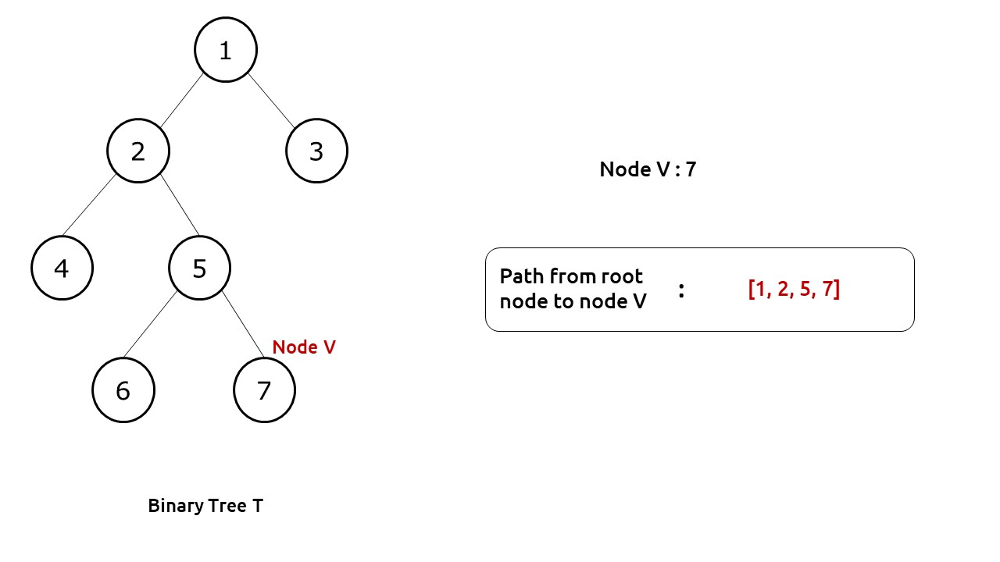
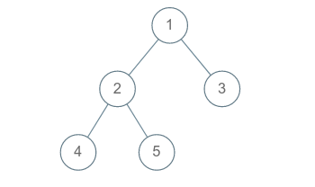
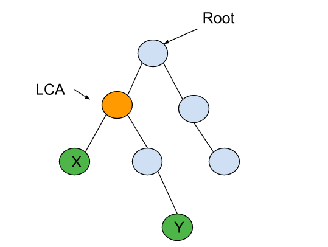
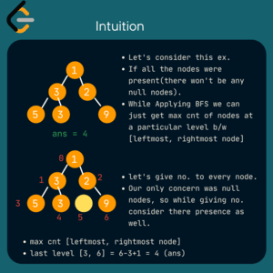

### 1. [All root to leaf paths in Binary Tree](https://www.codingninjas.com/studio/problems/all-root-to-leaf-paths-in-binary-tree._983599?utm_source=striver&utm_medium=website&utm_campaign=a_zcoursetuf&leftPanelTabValue=PROBLEM)
* You are given an arbitrary binary tree consisting of 'N' nodes numbered from 1 to 'N'. Your task is to print all the root to leaf paths of the binary tree.
* A leaf of a binary tree is the node which does not have a left child and a right child.
* _Example :_ 
* _Example :_   
*  _Output :_   [ [1 2 4] , [1 2 5 ] , [1 3] ]
* The problem is similar to finding path in grids , using backtracking . [here](https://github.com/gurutej7/DSA/blob/main/Backtracking/RatInaMaze.java)
* _Approach :_ we can use a traversal to visit all the nodes , and while visiting add that value to the current path ,if we have reached leaf or (given node) add path to result.
     ```java
       public static void pathToLeaf(TreeNode root, StringBuilder path, List<String> res) {
            if (root == null) return;
            // append current value to the path
            path.append(root.data).append(" ");

            if (root.left == null && root.right == null) { // leaf add the path to res
                res.add(path.toString());
                return;
            }
            // go left
            pathToLeaf(root.left, new StringBuilder(path), res);
            // go right
            pathToLeaf(root.right, new StringBuilder(path), res);
        }

        public static List<String> allRootToLeaf(TreeNode root) {
            List<String> res = new ArrayList<>();
            pathToLeaf(root, new StringBuilder(), res);
            return res;
        }
    ```

<br>

### 2. [Lowest Common Ancestor of a Binary Tree](https://leetcode.com/problems/lowest-common-ancestor-of-a-binary-tree/description/)
* Given a binary tree, find the lowest common ancestor (LCA) of two given nodes in the tree.
* **LCA** : The lowest common ancestor is defined between two nodes `p` and `q` as the lowest node in `T` that has both `p` and `q` as descendants (where we allow **a node to be a descendant of itself**).


* 


* _Example :_     
* **Input**: root = [3,5,1,6,2,0,8,null,null,7,4], p = 5, q = 1
*  **Output:** 3
* **Input**: Input: root = [3,5,1,6,2,0,8,null,null,7,4], p = 5, q = 4
* **Output**: 5
* **Explanation**: The LCA of nodes 5 and 4 is 5, since a node can be a descendant of itself according to the LCA definition.  [video reference](https://www.youtube.com/watch?v=_-QHfMDde90&t=84s).

    ```java
            // Time - O(n)
            // Space - O(n)
            public TreeNode lowestCommonAncestor(TreeNode root, TreeNode p, TreeNode q) {
                if(root == null || root == p || root == q) return root;

                TreeNode left = lowestCommonAncestor(root.left, p , q);
                TreeNode right = lowestCommonAncestor(root.right , p , q);

                if(left == null) return right;
                else if(right == null) return left;
                else return root;
            }
    ```


### 3. [Maximum Width  of  Binary Tree](https://leetcode.com/problems/maximum-width-of-binary-tree/description/)
* Given the `root` of a binary tree, return the **maximum width** of the given tree.
* The **maximum width** of a tree is the maximum **width** among all levels.
* The **width** of one level is defined as the length between the end-nodes (the leftmost and rightmost non-null nodes), where the null nodes between the end-nodes that would be present in a complete binary tree extending down to that level are also counted into the length calculation.
*   
* [DFS solution](https://leetcode.com/problems/maximum-width-of-binary-tree/solutions/106654/java-c-very-simple-dfs-solution/)
* [video Solution](https://www.youtube.com/watch?v=ZbybYvcVLks&t=1324s)
* [My submission1](https://leetcode.com/submissions/detail/1168436624/)


### 4. [All Nodes Distance K in Binary Tree](https://leetcode.com/problems/all-nodes-distance-k-in-binary-tree/)
* Given the `root` of a binary tree, the value of a `target` node target, and an integer `k`, return an array of the values of all nodes that have a distance k from the target node.
* You can return the answer in any order.


* _Example :_ 
* _Input :_ root = [3,5,1,6,2,0,8,null,null,7,4], target = 5, k = 2
* _Output :_ Output: [7,4,1]
* Explanation: The nodes that are a distance 2 from the target node (with value 5) have values 7, 4, and 1.
* _Intuition :_
    * Imagine if this problem were represented as a graph. Life would be so much simpler! Just apply a Breadth-First Search (BFS) starting from the target node and output the kth level. Easy peasy, right? XD
    * But alas, it's LeetCode we're dealing with, and they've chosen to throw a curveball by giving us a tree instead. But fear not, because Simply keep a parent pointer, and suddenly, the tree becomes a graph! Hehe.
    * Here's how it works: Before pushing the left and right nodes, perform a BFS traversal and store the parents in a convenient map. That way, you'll have the necessary pointers to convert the tree into a graph.
    * Now, let's take things a step further! Traverse the graph in three directions: left, right, and upwards. Remember to keep track of the nodes you've visited along the way.
    * [My Submission](https://leetcode.com/submissions/detail/1168555566/)
    * There are other approaches in the [Leetcode Solutions](https://leetcode.com/problems/all-nodes-distance-k-in-binary-tree/solutions/)


### 5. [Construct Binary Tree from inorder and preorder Traversal](https://leetcode.com/problems/construct-binary-tree-from-preorder-and-inorder-traversal/description/)
* Given two integer arrays `preorder` and `inorder` where preorder is the preorder traversal of a binary tree and inorder is the inorder traversal of the same tree, construct and return the _binary tree_.
* [Reference article](https://takeuforward.org/data-structure/construct-a-binary-tree-from-inorder-and-preorder-traversal/)


### 6. [Construct Binary Tree from inorder and postorder Traversal](https://leetcode.com/problems/construct-binary-tree-from-inorder-and-postorder-traversal/description/)
* Given two integer arrays `inorder` and `postorder` where inorder is the inorder traversal of a binary tree and postorder is the postorder traversal of the same tree, construct and return the _binary tree_.
* [Reference article](https://takeuforward.org/data-structure/construct-binary-tree-from-inorder-and-postorder-traversal/)


 