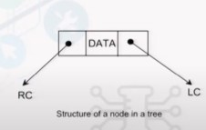
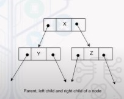
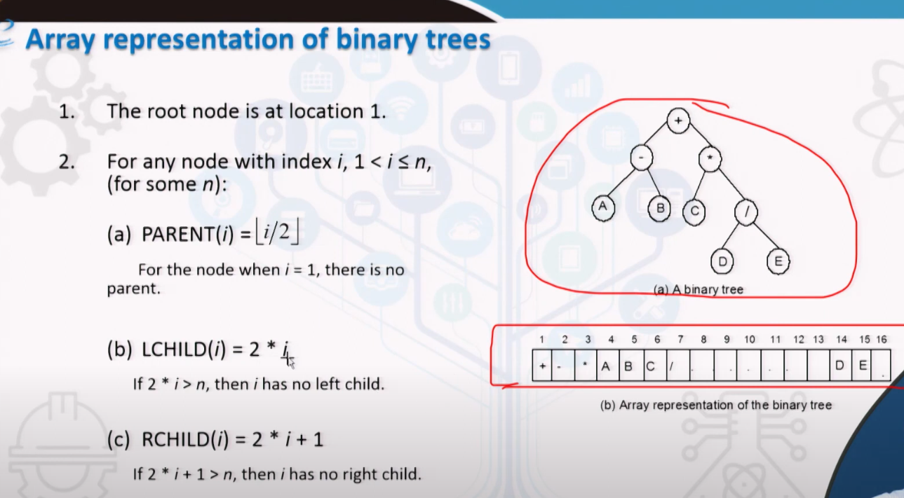
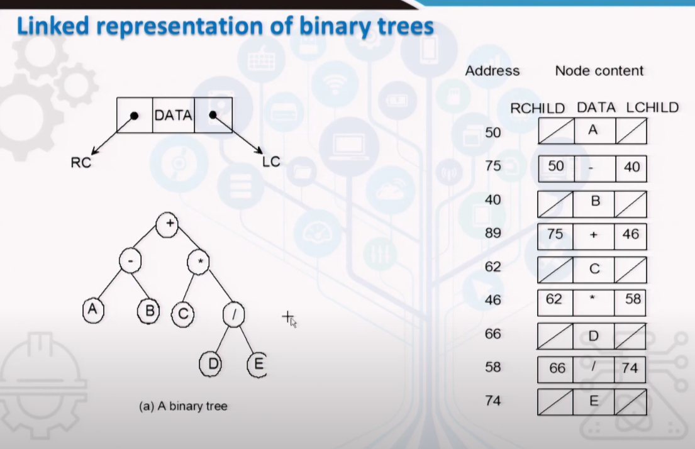
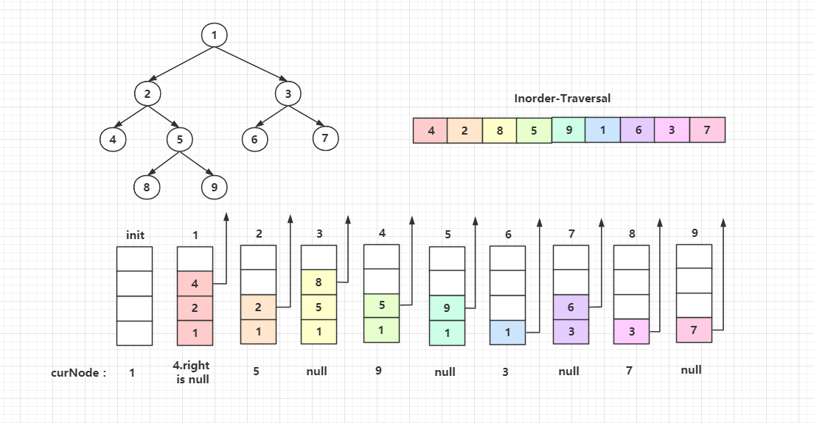
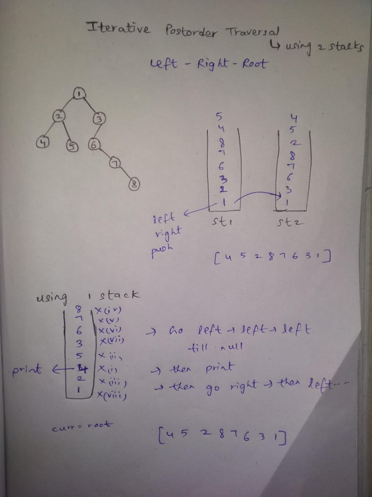
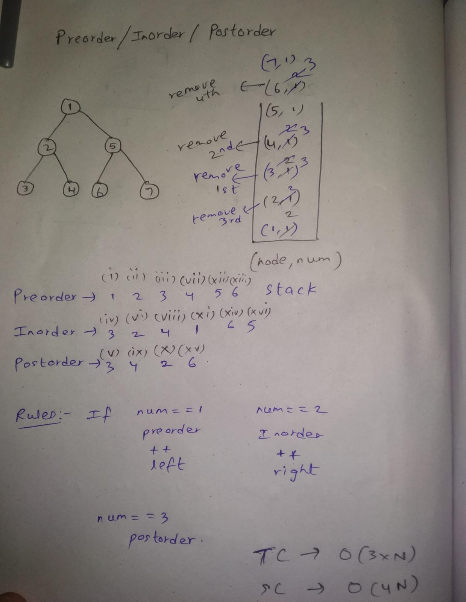
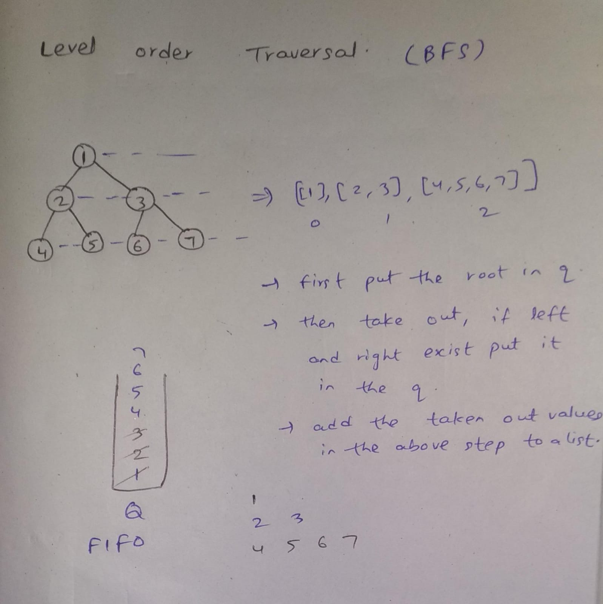

# Trees
### Basic Terminologies
1. **Node :** This is a main component of any tree structure. The concept of node is same as used in Linked List. Node of a tree stores the actual data and links to the other node.

          
    * LC => Left child link
    * RC => Right child link
2. **Parent :** Parent of a node is the immediate predecessor of a node. For example, in the following figure, _X_ is the parent of _Y_ and _Z_.

    
    
3. **Child :** In the above example _Y_ and _Z_ are called as child to node _X_.
4. **Link :** This is a pointer to a Node. In the Node Example above _LC_ and _RC_ are called as link.
5. **Root :** This is a specially designated node which has no parent. In the above example _X_ is the parent.
6. **Leaf Node :** The node which is at the end and which does not have any child is called _leaf_ node, In the above example _Y_ and _Z_ are the leaf nodes. Leaf node is alternatively termed as terminal node.
7. **Sibling Node :** The nodes which have the same parent are called _siblings_. In the above example,_Y_ and _Z_ are sibling nodes.
8. **Level :** Level is the rank of the hierarchy and root node is termed as in level _0_. If a node is at level **l** then its child is at level **l+1** ans parent is at level **l-1**. This is true for all nodes except the root node. Level of the root node is _zero_.
9. **Height :** Maximum number of nodes that is possible in a path starting from root node to a leaf node is called _height_ of a tree. **h = Lmax + 1**, where **h** is the height and **Lmax** is the maximum level of the tree.
10. **Degree :** Maximum number of children that is possible for a node is known as _degree_ of a node.

## Binary Tree
1. A binary tree is a special type of tree which has at max two children.
2. Full binary tree, If it contains maximum possible number of nodes in all levels.
3. Maximum possible nodes at **i**th level is **2^i**.
4. Skewed binary tree, if all its levels, all nodes contain only one child.

### Properties of a Binary Tree
1. Maximum number of nodes on level **l** is **2^l**, where **l** >= 0
2. Maximum number of nodes possible in a binary tree of height **h** is **2^h - 1**.
3. Minimum number of nodes possible in a binary tree of height **h** is **h**.
4. For any non-empty binary tree, if **n** is the number of nodes and **e** is the number of edges, then **n = e + 1**.
5. If **nL** is the number of leaf nodes (degree = 0) and **nI** is the number of internal nodes (degree == 2) , then **nL = nI + 1**.
6. Height of a complete binary tree with **n** number of nodes is **log (n+1)**.

### Representation of a Binary Tree
1. Array Representation =>refer  <!- (resources/imagesMD/arrayRepresentation.png) ->
    <!--  -->

2. LinkedList Representation => refer <!- (resources/imagesMD/linkedRepresentation.png) ->
    <!--  -->

### TreeNode 
In General the structure of a node of a binary tree is as follows 

```java
public class TreeNode {
        int val;
        TreeNode left;
        TreeNode right;
        TreeNode() {}
        TreeNode(int val) { 
            this.val = val; 
            this.left = null;
            this.right = null;
            }
        TreeNode(int val, TreeNode left, TreeNode right) {
            this.val = val;
            this.left = left;
            this.right = right;
        }
}
```

## Traversals

### **PreOrder Traversal**
* In preorder traversal, the root node is visited first, then left subtree and then right subtree.
* The flow of the traversal is in the order **root**  ->  **left**  ->  **right**
* Practice [Binary Tree Pre Order Traversal](https://leetcode.com/problems/binary-tree-preorder-traversal/) 
* Pick some examples from the above problem and draw recursion tree.

1. _Recursive Approach_
```java
// Time - O(n) => where n is the number of nodes
// space - O(n) => recursive stack space
// The list pre has the values of the tree in the pre-order
private static void preorder(TreeNode root , List<Integer> pre){
        if(root == null) return ;
        // add the root value
        pre.add(root.val);
        // then go to the left subtree
        preorder(root.left,pre);
        // after left then go to the right subtree
        preorder(root.right,pre);

    }
```

2. _Iterative Approach_
```java
// Time - O(n) => where n is the number of nodes
// space - O(n)
 public List<Integer> preorderTraversal(TreeNode root) {
        List<Integer> pre = new ArrayList<>();
        Stack<TreeNode> st = new Stack<>();
        if(root == null) return pre;
        st.push(root);
        while(!st.isEmpty()){
            TreeNode curr = st.pop();
            pre.add(curr.val);
            // we have to print left first, so we are pushing right first (Stack => Last in First Out)
            if(curr.right != null) st.push(curr.right);
            if(curr.left  != null) st.push(curr.left);

        }
        return pre;
    }
```

### **Inorder Traversal**
* In inorder traversal, the left subtree  is visited first, then root node and then right subtree.
* The flow of the traversal is in the order **left**  ->  **root**  ->  **right**
* Practice [Binary Tree Inorder Traversal](https://leetcode.com/problems/binary-tree-inorder-traversal/description/)

1. _Recursive Approach_
```java
// Time - O(n) => where n is the number of nodes
// space - O(n) => recursive stack space
// The list in has the values of the tree in the in-order
 private static void inOrder(TreeNode root , List<Integer> in){
        if(root == null) return;

        // Left subtree
        inOrder(root.left,in);
        // Root
        in.add(root.val);
        // Right Subtree
        inOrder(root.right,in);
    }
```

2. _Iterative Approach_
* We push all the left children of root into the stack until there's no more nodes.
* Then we pop from the stack which we'd call cur.
* Add cur to result list
* Then repeat the process for cur's right child.

```java
// Time - O(n) => where n is the number of nodes
// space - O(n) 
public List<Integer> inorderTraversal(TreeNode root) {
    List<Integer> list = new ArrayList<Integer>();
    Stack<TreeNode> stack = new Stack<TreeNode>();
    TreeNode cur = root;
    while(cur!=null || !stack.empty()){
        while(cur!=null){
            stack.add(cur);
            cur = cur.left;
        }
        cur = stack.pop();
        list.add(cur.val);
        cur = cur.right;
    }

    return list;
}
```
* Visualization of the above code is as follows   
<br>



### **PostOrder Traversal**
* In postorder traversal, the left subtree  is visited first, then right subtree and then root node.
* The flow of the traversal is in the order **left**  ->  **right**  ->  **root**
* Practice [Binary Tree Post Order Traversal](https://leetcode.com/problems/binary-tree-postorder-traversal/description/) 
* Pick some examples from the above problem and draw recursion tree.

1. _Recursive Approach_
```java
    // Time - O(n) => where n is the number of nodes
    // space - O(n) => recursive stack space
    // The list in has the values of the tree in the post-order
    private static void postorder(TreeNode root , List<Integer> post){
        if(root == null) return ;

        postorder(root.left,post);
        postorder(root.right,post);
        post.add(root.val);

    }
```

2. _Iterative Approach - 1_
```java
// Time - O(n) => where n is the number of nodes
// space - O(2*n) 
 public List<Integer> postorderTraversal(TreeNode root) {
        List<Integer> post = new ArrayList<>();
        Stack<TreeNode> st1 = new Stack<>();
        Stack<TreeNode> st2 = new Stack<>();

        if(root == null) return post;
        st1.push(root);
        while(!st1.isEmpty()){
            TreeNode curr = st1.pop();
            st2.add(curr);
            if(curr.left != null)st1.push(curr.left);
            if(curr.right != null)st1.push(curr.right);
        }

        while(!st2.isEmpty()) 
            post.add(st2.pop().val);

        return post;
    }
```

* Visualization of the above approach
<br>



3. _Iterative Approach - 2_
```java
    // Time - O(2n)
    // space - O(n)
    public List<Integer> postorderTraversal(TreeNode root) {
        List<Integer> post = new ArrayList<>();
        if(root == null) return post;
        Stack<TreeNode> st = new Stack<>();
        TreeNode curr = root;

        while(curr != null || !st.isEmpty()){
            if(curr != null){
                st.push(curr);
                curr = curr.left;
            }
            else{
                TreeNode temp = st.peek().right;
                if(temp == null){
                    temp = st.peek();
                    st.pop();
                    post.add(temp.val);

                    while(!st.isEmpty() && temp == st.peek().right){
                        temp = st.peek();
                        st.pop();
                        post.add(temp.val);
                    }
                }
                else 
                    curr = temp;
            }
        }

        return post;
    }

```

3. _All Traversals_
```java
 public static void allTraversal(TreeNode root, List < Integer > pre, List < Integer > in , List < Integer > post) {
        Stack < Pair > st = new Stack < Pair > ();
        st.push(new Pair(root, 1));
        
        if (root == null) return;

        while (!st.isEmpty()) {
            Pair it = st.pop();

            // this is part of pre
            // increment 1 to 2 
            // push the left side of the tree
            if (it.num == 1) {
                pre.add(it.node.val);
                it.num++;
                st.push(it);

                if (it.node.left != null) {
                    st.push(new Pair(it.node.left, 1));
                }
            }

            // this is a part of in 
            // increment 2 to 3 
            // push right 
            else if (it.num == 2) { in .add(it.node.val);
                it.num++;
                st.push(it);

                if (it.node.right != null) {
                    st.push(new Pair(it.node.right, 1));
                }
            }
            // don't push it back again 
            else {
                post.add(it.node.val);
            }
        }
 

    }
class Pair {
    TreeNode node;
    int num;
    Pair(TreeNode _node, int _num) {
        num = _num;
        node = _node;
    }
}
```

* visualization of the above code
<br>




### **Level Order Traversal**
* In level order traversal, the nodes are visited from left to right.
* The root is at _0_ th level.
* After Completing one level entirely then only the new level is visited.
* Practice [Binary Tree Level Order Traversal](https://leetcode.com/problems/binary-tree-level-order-traversal/description/) 

1. _Recursive Approach_
```java
// Time - O(n) => n is the number of nodes
// space - O(n) => Auxiliary stack space
 public List<List<Integer>> levelOrder(TreeNode root) {
        List<List<Integer>> res = new ArrayList<>();
        levelHelper(res, root, 0);
        return res;
    }
    
    public void levelHelper(List<List<Integer>> res, TreeNode root, int level) {
        if (root == null) return;
        if (level >= res.size()) {
            res.add(new LinkedList<Integer>());
        }
        res.get(level).add(root.val);
        levelHelper(res, root.left, level+1);
        levelHelper(res, root.right, level+1);
    }
```



2. _Iterative Approach_
```java
// Time - O(n) => n is the number of nodes
// space - O(n) 
 public List<List<Integer>> levelOrder(TreeNode root) {
        List<List<Integer>> ans = new ArrayList<>();
        if(root == null) return ans;
        Queue<TreeNode> q = new LinkedList<>();
        q.offer(root);
        while(!q.isEmpty()){
            List<Integer> curr = new ArrayList<>();
            int level = q.size();
            for(int i = 0 ; i < level ; i++){
                TreeNode temp = q.peek();
                if(temp.left != null) q.offer(temp.left);
                if(temp.right != null) q.offer(temp.right);
                curr.add(temp.val);
                q.poll();
            }
            ans.add(curr); 
        }

        return ans;
    }
```


